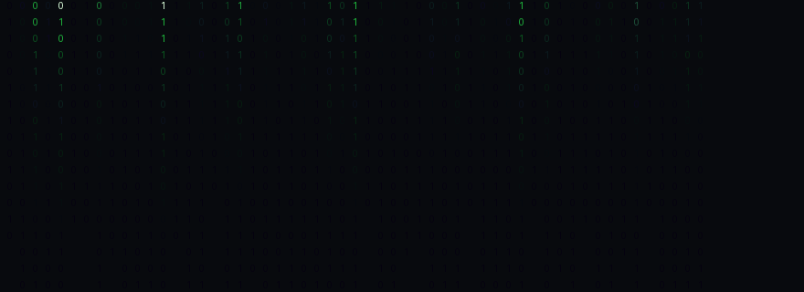

<h1 align="center">

</h1>

<h1 align="center">PRASHANNA</h1>

---

## About

Security researcher at the intersection of **AI and cyberspace**. I build AI-driven offensive tools, adversarial ML systems, and intelligent threat analysis platforms. My work focuses on automating exploitation, training models for vulnerability discovery, and pushing the boundaries of AI-powered security research.

Currently building **CYPHEX** -- an AI-augmented security platform with intelligent attack orchestration.

---

## Languages & Technologies

---

## Current Project

### CYPHEX -- AI-Augmented Security Platform

| Component | Description |
|-----------|-------------|
| **Firmware** | ESP32-based wireless security testing with automated attack orchestration |
| **Android App** | Kotlin/Compose controller with Bluetooth SPP + WebSocket connectivity |
| **AI Layer** | Intelligent scan analysis, automated threat classification, adaptive attack selection |

---

## GitHub Stats

<table>
  <tr>
    <td></td>
    <td></td>
  </tr>
</table>

---

