<div align="center">


</div>

<div align="center">



</div>

<div align="center">

<a href="https://git.io/typing-svg">
  
</a>

</div>

---

<div align="center">


</div>

---

```
+------------------------------------------------------------------+
|  [ SYSTEM SPECS ]                                                 |
|                                                                   |
|  > Focus ......... Robotics / AI / Deep Learning                 |
|  > Stack ......... Python | C++ | C | PyTorch | ROS              |
|  > Interest ...... Autonomous Systems | Edge AI | Vision         |
|  > Status ........ Building the future, one commit at a time     |
|                                                                   |
+------------------------------------------------------------------+
```

---

<div align="center">


</div>

---

<div align="center">


</div>

---

<div align="center">


</div>

<div align="center">


</div>

---

<div align="center">

<a href="https://www.linkedin.com/in/prashanna-tiwari-1b9a01398/">

</a>


</div>

<div align="center">


</div>
